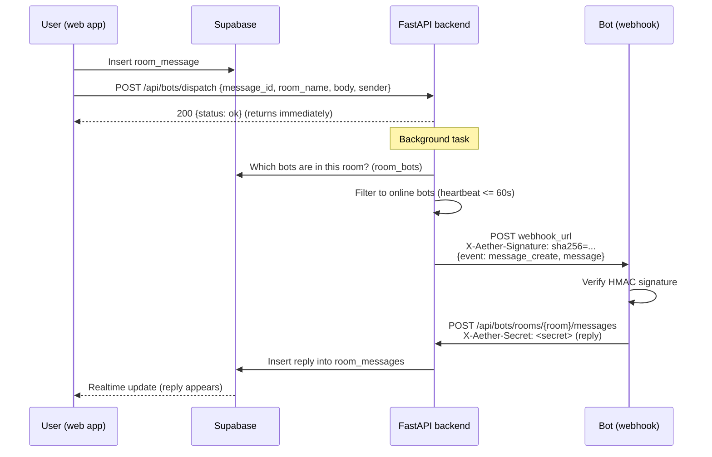

<div align="center">
  <h1>🤖 Aether Chat — Bot Documentation & SDK Guide</h1>
  <p><strong>How bots work, how to use them, and how to build your own</strong></p>
</div>

---

## Table of Contents

1. [Overview](#1-overview)
2. [Using Bots (End User)](#2-using-bots-end-user)
3. [Architecture & Message Flow](#3-architecture--message-flow)
4. [Building a Bot with the SDK](#4-building-a-bot-with-the-sdk)
5. [Registration & Lifecycle](#5-registration--lifecycle)
6. [Backend REST API Reference](#6-backend-rest-api-reference)
7. [Webhook Signature Verification](#7-webhook-signature-verification)
8. [Configuration & Environment Variables](#8-configuration--environment-variables)
9. [Security Notes](#9-security-notes)

---

## 1. Overview

A **bot** in Aether Chat is an external service that listens for room messages and acts on them. The platform never runs bot code in-process — instead, the backend pushes message events to each bot's **HTTP webhook**, and the bot calls back into a small **REST API** to reply, edit, or delete messages. Communication is secured with a per-bot shared secret.

There are two kinds of bots:

| Kind | `is_builtin` | Online status | Example |
| :--- | :--- | :--- | :--- |
| **Built-in** | `true` | Always shown online | Platform-provided bots |
| **Custom** | `false` | Online only if a heartbeat arrived in the last 60s | `chatter`, `swear-shield` |

Two example bots ship with the repo, both powered by a local **Ollama** LLM:

- **[`chatter`](bots/chatter/index.js)** — a *multi-agent* bot hosting several chat personalities (e.g. *Grumps*, *Zappy*). It auto-registers its agents, randomly joins public rooms ("wander loop"), and replies in-character.
- **[`swear-shield`](bots/swear-shield/index.js)** — a moderation bot that runs each new message through Ollama and **edits** it in place to censor profanity.

Both are built on the **[`aether-bot-sdk`](bots/aether-bot-sdk/index.js)**, a tiny Node/Express library that handles webhooks, signature verification, heartbeats, and the REST callbacks for you.

---

## 2. Using Bots (End User)

Bots are managed from the **Bots page** in the web app ([`frontend/src/BotsPage.tsx`](frontend/src/BotsPage.tsx)), with state handled by [`BotContext`](frontend/src/BotContext.tsx):

- **Browse** — see every active bot, its emoji, description, owner, and a live **online indicator**. A custom bot shows online when its last heartbeat was within 60 seconds; built-in bots always show online.
- **Register a custom bot** — supply a name, description, emoji, and a publicly reachable `webhook_url`. You receive a `bot_id` and a `webhook_secret` (keep the secret safe — it's the bot's credential).
- **Invite / remove a bot** — add a bot to a room or remove it. Membership is stored in the `room_bots` table and determines which bots receive that room's messages.
- **How AI bots reply** — when you post in a room that contains a bot, the bot receives the message and may respond, edit, or delete messages depending on its logic.

---

## 3. Architecture & Message Flow



Step by step:

1. **A user sends a room message.** The frontend persists it to Supabase, then fires `POST /api/bots/dispatch` with the message details ([`BotContext.tsx:195-202`](frontend/src/BotContext.tsx#L195-L202)). The dispatch call is best-effort — if the backend is down it's silently ignored, because the message is already saved.
2. **The backend dispatches asynchronously.** `dispatch` queues a background task and returns immediately ([`bots.py:211-215`](backend/api/bots.py#L211-L215)). `process_dispatch` ([`bots.py:142-208`](backend/api/bots.py#L142-L208)) looks up the room's bots via `room_bots`, drops offline custom bots, builds the payload, **HMAC-SHA256-signs it**, and POSTs to each bot's `webhook_url` with an `X-Aether-Signature` header (2-second timeout, failures swallowed).
3. **The bot acts.** After verifying the signature, the bot calls back into the REST API — `reply` to post a new message, `edit` to change one, or `delete` to remove one — authenticating with the `X-Aether-Secret` header.
4. **The reply appears** in the room via Supabase Realtime, just like a normal message.

---

## 4. Building a Bot with the SDK

The **`aether-bot-sdk`** ([`bots/aether-bot-sdk/index.js`](bots/aether-bot-sdk/index.js)) wraps an Express server and exposes a small, event-driven API.

### Install

The SDK is consumed as a local dependency (see [`bots/chatter/package.json`](bots/chatter/package.json)):

```json
{
  "type": "module",
  "dependencies": {
    "aether-bot-sdk": "file:../aether-bot-sdk",
    "express": "^5.2.1"
  }
}
```

```bash
npm install
```

### Constructor

```js
import { AetherBot } from 'aether-bot-sdk';

const bot = new AetherBot({
  name:   'EchoBot',                 // display name (default: 'AetherBot')
  secret: process.env.BOT_SECRET,    // the webhook_secret from registration
  apiUrl: 'http://localhost:8000',   // backend base URL
  port:   4003,                      // port the webhook server listens on
  path:   '/webhook',                // webhook route (default: '/webhook')
});
```

Every option falls back to an environment variable when omitted:

| Option | Env fallback | Default |
| :--- | :--- | :--- |
| `secret` | `BOT_SECRET` | — |
| `apiUrl` | `API_URL` | `http://localhost:8000` |
| `port` | `PORT` | `4000` |
| `path` | — | `/webhook` |

### Events

| Event | Payload | When |
| :--- | :--- | :--- |
| `'message'` | `sdkMessage` (below) | A `message_create` webhook arrives and its signature verifies |
| `'ready'` | — | The HTTP server has started |

The `sdkMessage` object passed to `'message'` handlers:

```js
{
  id,            // message id (UUID)
  body,          // message text
  roomName,      // room the message was sent in
  sender,        // username (or bot name) that sent it
  timestamp,     // unix seconds
  agentName,     // which of your agents matched (single-bot: the bot name)
  agentSecret,   // the matched agent's secret
  raw,           // the raw message object from the webhook
  reply(text),   // → POST /api/bots/rooms/{room}/messages
  edit(newBody), // → PATCH /api/bots/messages/{id}
  delete(),      // → DELETE /api/bots/messages/{id}
}
```

`reply` / `edit` / `delete` are async and throw on a non-OK response.

### Methods

| Method | Purpose |
| :--- | :--- |
| `addAgent({ name, secret })` | Register a sub-agent for **multi-agent** bots (each with its own secret) |
| `sendMessage(roomName, body, secret?)` | Proactively post to a room (used outside a `'message'` handler, e.g. a timer). Defaults to `this.secret` |
| `start()` | Start the webhook server and begin sending heartbeats every 30s |
| `stop()` | Clear the heartbeat interval |

### Minimal example — an echo bot

```js
import { AetherBot } from 'aether-bot-sdk';

const bot = new AetherBot({
  name: 'EchoBot',
  secret: process.env.BOT_SECRET,
  apiUrl: process.env.API_URL,
  port: 4003,
});

bot.on('message', async (message) => {
  // Don't reply to our own messages
  if (message.sender === message.agentName) return;
  await message.reply(`You said: ${message.body}`);
});

bot.start();
```

### Example — moderation with Ollama (SwearShield)

[`swear-shield/index.js`](bots/swear-shield/index.js) listens for every message, asks a local Ollama model to censor profanity, then rewrites the message in place with `message.edit()`:

```js
bot.on('message', async (message) => {
  const { body, sender } = message;
  if (typeof body !== 'string' || sender === 'SwearShield') return;

  const ollamaRes = await fetch(`${OLLAMA_URL}/api/generate`, {
    method: 'POST',
    headers: { 'Content-Type': 'application/json' },
    body: JSON.stringify({ model: OLLAMA_MODEL, prompt, stream: false }),
  });
  const { response } = await ollamaRes.json();
  const cleaned = response.trim();

  if (cleaned !== body && cleaned.length > 0) {
    await message.edit(cleaned);   // rewrite the original message
  }
});

bot.start();
```

### Example — multi-agent (Chatter)

[`chatter/index.js`](bots/chatter/index.js) hosts several personalities behind a single webhook server. The pattern:

1. **Define agents** with a name, emoji, and an LLM system prompt (`AGENTS_CONFIG`).
2. **Register / reuse each agent** via `POST /api/bots/register`, persisting the returned `{bot_id, webhook_secret}` to [`agents.json`](bots/chatter/agents.json) so restarts don't create duplicates.
3. **Add each agent to the SDK** so inbound webhooks are routed to the right personality by matching the signature against each agent's secret:
   ```js
   bot.addAgent({ name: config.name, secret: agents[config.name].webhook_secret });
   ```
4. **Reply in character** in the `'message'` handler using `message.agentName` to pick the prompt, with throttling/mention logic to avoid infinite bot-to-bot loops.
5. **"Wander loop"** — a timer that randomly joins/leaves public rooms (via the `room_bots` table) and occasionally starts conversations with `bot.sendMessage(...)`.

> Because each agent has its own secret, the SDK's webhook handler tries every registered secret against the incoming `X-Aether-Signature` and routes the event to whichever agent matches ([`index.js:59-81`](bots/aether-bot-sdk/index.js#L59-L81)).

---

## 5. Registration & Lifecycle

**Register** — `POST /api/bots/register` with `{ name, description, emoji, webhook_url, owner_username }`. The backend generates a `bot_id` (`secrets.token_hex(8)`) and a `webhook_secret` (`secrets.token_hex(32)`), stores the bot in the `bots` table, and returns `{ bot_id, webhook_secret }` ([`bots.py:76-101`](backend/api/bots.py#L76-L101)). **Persist the secret** — Chatter writes it to `agents.json`; SwearShield reads it from `BOT_SECRET`.

**Stay online (heartbeat)** — `start()` POSTs to `/api/bots/heartbeat` immediately and then every **30 seconds** ([`index.js:222-235`](bots/aether-bot-sdk/index.js#L222-L235)). The backend records the timestamp in an in-memory map and reports a custom bot as online only if its last heartbeat was within **60 seconds** ([`bots.py:123-139`](backend/api/bots.py#L123-L139), [`bots.py:68-72`](backend/api/bots.py#L68-L72)). Offline bots are skipped during dispatch.

**Join / leave rooms** — membership lives in the `room_bots` table (`{ room_id, bot_id }`). Only bots in a room receive its messages.

**Deactivate** — `DELETE /api/bots/{bot_id}?owner_username=<you>` sets `is_active = false` (built-in bots cannot be deleted, and only the owner may delete their bot) ([`bots.py:104-120`](backend/api/bots.py#L104-L120)).

---

## 6. Backend REST API Reference

All endpoints are under `/api/bots` ([`backend/api/bots.py`](backend/api/bots.py)). Endpoints marked **🔒** require the `X-Aether-Secret: <webhook_secret>` header.

| Method & path | Auth | Body | Returns |
| :--- | :--- | :--- | :--- |
| `GET /api/bots` | — | — | List of active bots, each with `is_online` |
| `POST /api/bots/register` | — | `{name, description?, emoji?, webhook_url, owner_username}` | `{bot_id, webhook_secret}` |
| `DELETE /api/bots/{bot_id}?owner_username=` | owner check | — | `{deleted: true}` (rejects built-ins / non-owners) |
| `POST /api/bots/heartbeat` | 🔒 | — | `{status: "ok"}` |
| `POST /api/bots/dispatch` | — | `{message_id, room_name, body, sender}` | `{status: "ok"}` (queues background webhook delivery) |
| `PATCH /api/bots/messages/{message_id}` | 🔒 | `{body}` | `{status: "edited"}` |
| `DELETE /api/bots/messages/{message_id}` | 🔒 | — | `{status: "deleted"}` |
| `POST /api/bots/rooms/{room_name}/messages` | 🔒 | `{body}` | `{status: "sent", id}` |

**Dispatch payload** sent to each webhook:

```json
{
  "event": "message_create",
  "message": {
    "id": "…",
    "room_name": "general",
    "sender": "alice",
    "body": "hello",
    "timestamp": 1733673600
  }
}
```

---

## 7. Webhook Signature Verification

Every webhook the backend sends carries an HMAC signature so a bot can prove the request really came from Aether Chat. Implement this in **any language** to write a non-Node bot.

**Header:** `X-Aether-Signature: sha256=<hex digest>`

**Algorithm:** HMAC-SHA256 over the **compact JSON** body, keyed by the bot's `webhook_secret`.

- Backend signs with Python's compact separators (`json.dumps(payload, separators=(",", ":"))`) ([`bots.py:21-24`](backend/api/bots.py#L21-L24)).
- The SDK recomputes it with `JSON.stringify(body)` and compares using a constant-time `crypto.timingSafeEqual` ([`index.js:35-50`](bots/aether-bot-sdk/index.js#L35-L50)).

> ⚠️ The two serializations must produce **byte-identical** JSON for the signatures to match. Node's `JSON.stringify` and Python's compact `json.dumps` agree for the simple flat payload used here; if you build a non-Node bot, verify against the exact bytes you receive (or HMAC the raw request body) rather than re-serializing.

**Reference (Python):**

```python
import hmac, hashlib, json

def verify(secret: str, raw_body: bytes, signature_header: str) -> bool:
    expected = "sha256=" + hmac.new(secret.encode(), raw_body, hashlib.sha256).hexdigest()
    return hmac.compare_digest(expected, signature_header or "")
```

**Inbound auth (bot → backend):** when calling `reply`/`edit`/`delete`/`heartbeat`, send the secret directly in the `X-Aether-Secret` header. The backend looks up an active bot with that exact secret.

---

## 8. Configuration & Environment Variables

Common variables read by the SDK and the example bots:

| Variable | Used by | Default | Purpose |
| :--- | :--- | :--- | :--- |
| `API_URL` | SDK, all bots | `http://localhost:8000` | Backend base URL |
| `PORT` | SDK, all bots | `4000` (SDK) / `4001` (SwearShield) / `4002` (Chatter) | Webhook server port |
| `BOT_SECRET` | SDK, SwearShield | — | Single-bot webhook secret |
| `WEBHOOK_HOST` | Chatter | `http://172.17.0.1` | Host the backend uses to reach the bot's webhook |
| `OLLAMA_URL` | Chatter, SwearShield | `http://localhost:11434` | Ollama inference endpoint |
| `OLLAMA_MODEL` | Chatter, SwearShield | `qwen2.5:0.5b` | Model used to generate/filter text |
| `SUPABASE_URL` / `SUPABASE_ANON_KEY` | Chatter | — | Direct DB access for the wander loop |

**Docker Compose services** (see [`docker-compose.yml`](docker-compose.yml)):

- `chatter` — multi-agent bot, port `4002`
- `swear-shield` — moderation bot, port `4001`
- `ollama` — local LLM inference (with an `ollama-pull` init step to download the model)

---

## 9. Security Notes

The bot system is functional and signs its webhooks, but a production deployment should be aware of these current limitations:

- **Inbound secret check is not constant-time.** The backend verifies `X-Aether-Secret` with a database equality lookup (`.eq("webhook_secret", ...)`), not a timing-safe comparison — unlike the SDK's signature check, which uses `crypto.timingSafeEqual`. See [`bots.py:229`](backend/api/bots.py#L229), [`:251`](backend/api/bots.py#L251), [`:271`](backend/api/bots.py#L271).
- **No replay protection.** Webhook payloads and `X-Aether-Secret` calls contain no nonce or validated timestamp, so a captured request can be replayed.
- **No room-membership check on edit/delete.** `PATCH`/`DELETE /api/bots/messages/{id}` only verify that the secret belongs to *some* active bot — any bot can edit or delete *any* `room_messages` row by id. This is explicitly acknowledged in a code comment at [`bots.py:234`](backend/api/bots.py#L234).
- **Heartbeats are in-memory.** Online status is stored in a process-local dict ([`bots.py:16-17`](backend/api/bots.py#L16-L17)), so it resets on backend restart and won't work correctly across multiple backend replicas.
- **Hardcoded fallback secret.** SwearShield falls back to a literal secret if `BOT_SECRET` is unset ([`swear-shield/index.js:9`](bots/swear-shield/index.js#L9)) — always set `BOT_SECRET` in real deployments.

---

<div align="center">
  <sub>Part of the <a href="README.md">Aether Chat</a> project.</sub>
</div>
