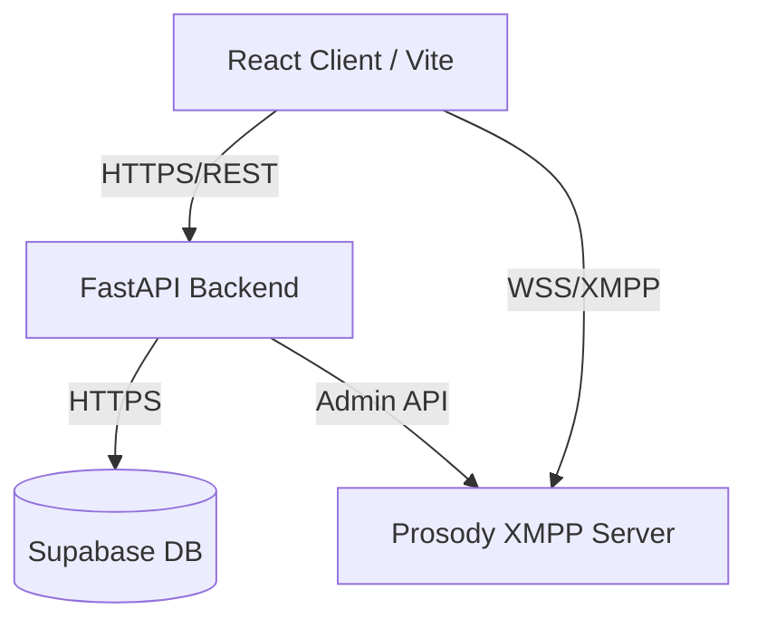
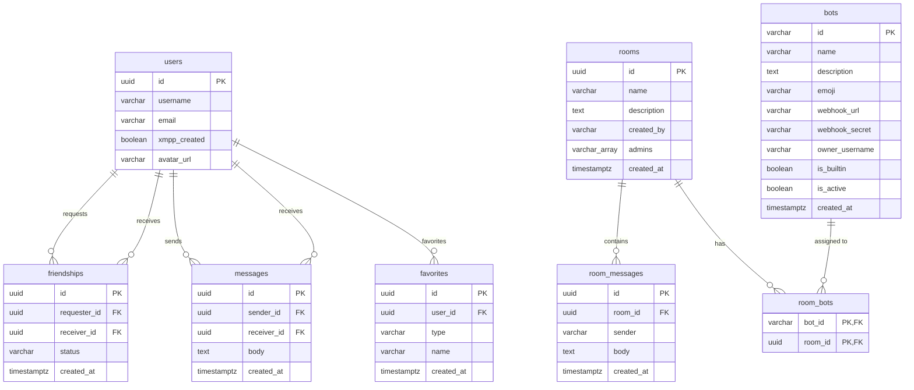

<div align="center">
  <!--  -->
  <h1>Aether Chat</h1>
  <p><strong>A modern, real-time messaging platform built on XMPP</strong></p>
  
  [](#)
  [](#)
  [](#)
  [](#)
  [](#)
  [](#)
  [](#)
</div>

---

## 📖 About The Project

Aether Chat is a real-time messaging platform built to integrate the robust XMPP protocol with a modern web frontend. The objective is to provide a fast, scalable, and fully responsive web-based communication experience.

The system utilizes React 19 and Tailwind CSS for the user interface, communicating with a Python FastAPI backend. Real-time messaging infrastructure is powered by a Prosody XMPP server, while Supabase handles secure authentication and data persistence.

## 🎯 Why Aether Chat?

- **🔓 Open standards, zero lock-in** — Built on XMPP, the same IETF-standardized protocol that has powered messaging at internet scale for two decades. Unlike platforms that invent a proprietary WebSocket protocol, Aether Chat speaks a federated, interoperable standard with presence, group chat, and message archiving baked in.
- **⚡ Instant, not eventually-consistent** — Messages, presence, and typing indicators travel over a persistent XMPP connection for true real-time delivery, while a parallel database layer guarantees durable history. You get the immediacy of a live socket *and* the reliability of a relational store.
- **🧩 Hybrid architecture done right** — Real-time transport (XMPP) and durable state (PostgreSQL) are cleanly separated, so neither bottlenecks the other. Each layer does what it is best at.
- **🤖 Extensible by design** — A first-class bot platform with signed webhooks lets you drop in AI agents (powered by local LLMs via Ollama) or moderation tools without touching the core.
- **📦 One command to run everything** — The entire stack — web app, API, XMPP server, reverse proxy, and AI bots — spins up with a single `docker-compose up`. No manual service wiring.
- **🔐 Single source of identity** — XMPP and the web app share one identity provider (Supabase Auth), so there are no duplicated passwords or out-of-sync accounts.

## ✨ Key Features

- **Real-Time Messaging**: Implemented via XMPP using a Prosody server. The frontend utilizes `stanza.js` over WebSockets, while the backend interacts through `slixmpp`. This gives instant delivery with built-in presence and delivery semantics — no custom socket protocol to maintain.
- **Direct Messages**: 1:1 conversations with online/offline presence, typing indicators (XEP-0085), unread counts, message editing, delete-for-self / delete-for-everyone, favorites, and file/image sharing.
- **Group Rooms (Multi-User Chat)**: Create, join, and manage chat rooms backed by XMPP MUC with server-side message archiving (`muc_mam`). Includes room admins, member kicking, system join/leave messages, and per-room unread tracking.
- **Friendships & Social Graph**: Friend requests with pending/accepted states and a live-presence friend list — all keyed on stable user IDs rather than mutable usernames.
- **AI & Bot Platform**: Browse and invite built-in or custom bots into rooms. AI agents reply using locally-hosted LLMs via **Ollama** (privacy-friendly, no per-token API costs), and a moderation bot keeps conversations clean. Bots integrate through HMAC-signed webhooks for secure, sandboxed extensibility. See the **[Bot Documentation & SDK Guide](BOTS.md)**.
- **Modern Interface**: Built from scratch using React 19 and Tailwind CSS v4, featuring a fluid, responsive design with comprehensive theme support.
- **Authentication & Discovery**: Powered by Supabase. Secure user registration, JWT-based login, and global user search functionality.
- **Optimized Performance**: Packaged with Vite 6, utilizing dynamic code-splitting and chunk management for minimal load times.
- **Internationalization (i18n)**: Fully localized interface with multi-language support.
- **Docker Ready**: The entire infrastructure (Frontend, Backend, XMPP Server, Reverse Proxy, and AI bots) can be deployed using a single `docker-compose` command.

## 🏗️ System Architecture



### Database Schema

The relational database schema is hosted on Supabase (PostgreSQL) and manages user profiles, friendships, direct messages, chat rooms, and bot integrations.



### Technology Stack

| Component | Technologies |
| :--- | :--- |
| **Frontend** | React 19, TypeScript, Vite 6, Tailwind CSS 4, React Router 7, Stanza.js, i18n |
| **Backend** | Python 3.12, FastAPI, Slixmpp, Pydantic, Passlib, Pytest |
| **Database** | Supabase (PostgreSQL + Auth + Realtime) |
| **AI / Bots** | Node.js bot SDK, Ollama (local LLM inference) |
| **Infrastructure**| Docker, Docker Compose, Prosody XMPP, Nginx (reverse proxy) |

## 🧠 Why These Technologies?

Every layer of the stack was chosen deliberately. Here is the reasoning, and how each choice stacks up against the common alternatives.

### Messaging & Real-Time

- **XMPP (vs. a custom WebSocket protocol or Matrix)** — XMPP is a mature, IETF-standardized protocol with presence, multi-user chat, message archiving, and federation already specified and tested at internet scale. Rolling a bespoke WebSocket protocol means re-implementing all of that (and its edge cases) yourself; Matrix is powerful but heavier and more complex to self-host. XMPP gives us proven primitives out of the box with broad client/server interoperability and no vendor lock-in.
- **Prosody (vs. ejabberd or MongooseIM)** — Prosody is a lightweight, low-memory XMPP server with an exceptionally simple Lua module system. That let us write small custom modules — `mod_auth_supabase` (delegate auth to our backend), `mod_online_rest`, and `mod_admin_net` — in a fraction of the effort ejabberd's Erlang or MongooseIM's heavier footprint would demand. Ideal for a focused deployment.
- **stanza.js (vs. strophe.js)** — A modern, TypeScript-friendly XMPP client with first-class WebSocket support and a cleaner async API, where strophe.js carries an older, callback-heavy design.

### Frontend

- **React 19 (vs. Angular or Vue)** — The largest ecosystem and talent pool, plus React 19's improved concurrent rendering and hooks. Angular is more opinionated and heavyweight for an SPA of this size; Vue is excellent but has a smaller third-party ecosystem for niche needs like XMPP and emoji tooling.
- **Vite 6 (vs. Webpack or Create React App)** — Native ESM dev server with near-instant hot-module reload and dramatically faster cold starts than Webpack. CRA is effectively deprecated and slow to build. Vite also ships production-grade code-splitting (vendor chunks for React, Supabase, XMPP, etc.) with near-zero config.
- **Tailwind CSS 4 (vs. Bootstrap or Material UI)** — Utility-first styling keeps design decisions in the markup with no context-switching to separate CSS files, and the JIT engine ships only the classes you use for tiny bundles. Component libraries like Bootstrap or MUI impose their own look and runtime weight; Tailwind gives full design control with CSS-variable theming.
- **TypeScript (vs. plain JavaScript)** — Static typing across ~6k lines of UI catches errors at compile time and makes the XMPP/Supabase data contracts self-documenting.
- **React Context (vs. Redux)** — For this app's needs, scoped Context providers (Auth, Chat, MUC, Bots, Language) deliver clean global state without Redux's boilerplate and middleware ceremony.

### Backend

- **FastAPI (vs. Flask or Django)** — Async-native (a natural fit for I/O-bound XMPP and database calls), with automatic OpenAPI/Swagger docs and Pydantic-powered request validation for free. Flask is synchronous and requires manual wiring for validation and docs; Django is a batteries-included monolith that's overkill for a focused API service.
- **Pydantic (vs. hand-written validation)** — Declarative, type-driven validation and settings management that eliminates entire classes of input-handling bugs.
- **slixmpp (vs. a raw socket client)** — A mature async Python XMPP library so the backend can track presence and online users without re-implementing the protocol.

### Data & Auth

- **Supabase (vs. Firebase or a self-managed Postgres + custom auth)** — Supabase bundles a real **PostgreSQL** database, authentication, row-level security, realtime subscriptions, and storage into one open-source platform. Unlike Firebase's proprietary NoSQL (Firestore), we get full relational power, SQL, and no vendor lock-in — while still getting managed auth and live updates that would otherwise take weeks to build. Crucially, it acts as the single source of identity that Prosody authenticates against.

### AI & Infrastructure

- **Ollama (vs. the OpenAI / hosted LLM APIs)** — Local LLM inference means conversations never leave your infrastructure, there are no per-token costs, and the platform works fully offline. Ideal for privacy-sensitive deployments where sending message content to a third party is a non-starter.
- **Docker Compose (vs. manual setup or Kubernetes)** — One declarative file brings up every service — frontend, backend, Prosody, Nginx, and AI bots — reproducibly on any machine. Kubernetes would be operational overkill for a single-host deployment; manual setup is error-prone and hard to onboard.
- **Nginx (reverse proxy)** — A single public entrypoint (port 8085) that routes to the frontend, API, and XMPP BOSH endpoint, simplifying CORS and TLS termination.

## 🚀 Quick Start

The platform is fully containerized using Docker for seamless local deployment.

**Prerequisites**: [Docker Desktop](https://www.docker.com/products/docker-desktop/) must be installed and running.

### 1. Clone the repository
```bash
git clone https://github.com/EDward1101-bit/originalRepoName
cd originalRepoName
```

### 2. Configure environment variables
Copy the root example configuration file and add your credentials:
```bash
cp .env.example .env
```
*(Open the `.env` file and set the following:)*
- `SUPABASE_URL` and `SUPABASE_ANON_KEY`: Your Supabase credentials.
- `SERVER_HOSTNAME`: Set this to `localhost` for local development, or to your **remote IP or domain name** (e.g., `1.2.3.4` or `chat.example.com`) if deploying to a server. This is critical for both API access and XMPP messaging.

### 3. Start the containers
The following command will build the project and initialize all services:
```bash
docker-compose up --build
```

### 4. Access the Application
- **Frontend App**: [http://localhost:8085](http://localhost:8085)
- **Backend API**: [http://localhost:8085/api](http://localhost:8085/api)
- **API Documentation**: [http://localhost:8085/api/docs](http://localhost:8085/api/docs)


## 📚 Documentation

- **[Bot Documentation & SDK Guide](BOTS.md)** — what bots are, how to use them, the `aether-bot-sdk` API, the webhook protocol, and how the bot system is implemented.
- **[Docker Setup Guide](DOCKER.md)** — container architecture and deployment details.

## 🤝 Contributing

Contributions, issues, and feature requests are welcome! Feel free to check the [issues page](#). For major changes, please open an issue first to discuss what you would like to change.

## 📝 License

Distributed under the MIT License. See `LICENSE` for more information.
