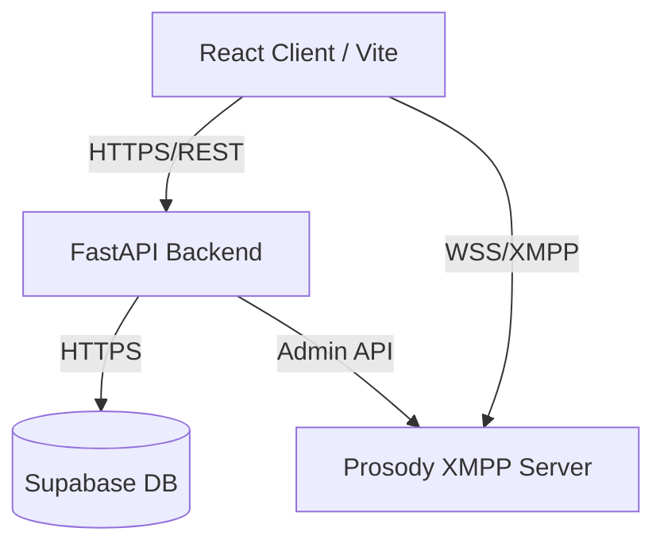

<div align="center">
  <!--  -->
  <h1>Aether Chat</h1>
  <p><strong>A modern, real-time messaging platform built on XMPP</strong></p>
  
  [](#)
  [](#)
  [](#)
  [](#)
  [](#)
  [](#)
  [](#)
</div>

---

## 📖 Why I built this

I started Aether Chat to see if I could bridge the gap between a bulletproof, traditional protocol like XMPP and a cutting-edge React stack. My goal was simple: build a Discord-like web chat that is actually fast, responsive, and easy to deploy.

The UI is built from scratch with React 19 and Tailwind CSS, backed by a Python FastAPI server. For the actual live messaging, I set up a Prosody XMPP server, keeping user data and authentication tightly managed via Supabase.

This repo is my playground for architectural decisions, handling tricky WebSocket connections, and writing clean, scalable code.

## ✨ What's working so far

- **Real-Time Messaging**: Runs on XMPP. I'm using `stanza.js` on the client and `slixmpp` on the backend to talk to the Prosody server.
- **Fluid UI**: Fully responsive, dark/light modes, and a layout that feels native.
- **Auth & Discovery**: Handled securely by Supabase. You can register, log in with JWTs, and search the platform for other users.
- **Vite Optimized**: Dynamic code splitting and chunk management means it loads almost instantly.
- **i18n Ready**: The entire interface supports multiple languages out of the box.
- **Containerized**: Everything (Frontend, API, DB connections, XMPP Server) spins up with a single `docker-compose` command.

## 🏗️ Architecture



### Stack Details

| Component | Technologies |
| :--- | :--- |
| **Frontend** | React 19, TypeScript, Vite 6, TailwindCSS 4, React Router 7, Stanza.js, i18n |
| **Backend** | Python 3.12, FastAPI, Slixmpp, Pydantic, Passlib, Pytest |
| **Database** | Supabase (PostgreSQL) |
| **Infrastructure**| Docker, Docker Compose, Prosody XMPP |

## 🚀 Running it locally

I've Dockerized the whole stack so you don't have to install Python or Node locally if you don't want to.

**Prerequisites**: Just make sure you have [Docker Desktop](https://www.docker.com/products/docker-desktop/) installed.

### 1. Clone it
```bash
git clone https://github.com/EDward1101-bit/originalRepoName
cd originalRepoName
```

### 2. Set up environments
Copy the example configs and drop in your Supabase credentials:
```bash
cp backend/.env.example backend/.env
cp frontend/.env.example frontend/.env
```
*(Open both `.env` files and add your `SUPABASE_URL` and `SUPABASE_ANON_KEY` / `SERVICE_KEY`.)*

### 3. Spin it up
This grabs the images, installs dependencies, and boots the servers:
```bash
docker-compose up --build
```

### 4. Check it out
- **Frontend App**: [http://localhost:5173](http://localhost:5173)
- **Backend API**: [http://localhost:8000](http://localhost:8000)
- **API Docs (Swagger)**: [http://localhost:8000/docs](http://localhost:8000/docs)

## 📁 Repository Structure

```text
.
├── backend/               # FastAPI Python application
│   ├── api/               # REST endpoints
│   ├── models/            # Pydantic models
│   ├── services/          # Core business logic & Slixmpp integration
│   ├── tests/             # Pytest test suite
│   └── main.py            # API entry point
├── frontend/              # React application
│   ├── src/               # React components, contexts, hooks
│   ├── index.html         # Main HTML
│   └── vite.config.ts     # Vite bundler config
├── prosody/               # XMPP server config & Lua plugins
└── docker-compose.yml     # Container orchestration
```

## 🗺️ What's Next?

- [x] Core Auth and User Search
- [x] XMPP Websocket Integration
- [x] Multi-language support (i18n)
- [ ] **WebRTC**: Voice and video calling directly in the browser.
- [ ] **E2EE**: End-to-End Encryption using OMEMO.
- [ ] **File Transfers**: Sending attachments via XMPP.

## 📝 License

Distributed under the MIT License. See `LICENSE` for details.
