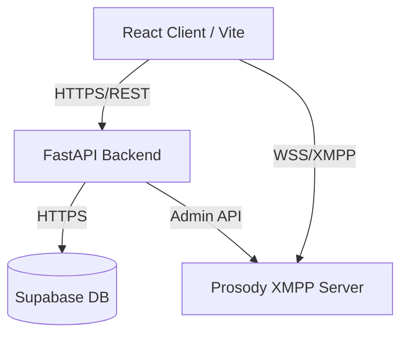

<div align="center">
  <!--  -->
  <h1>Aether Chat</h1>
  <p><strong>A modern, real-time messaging platform built on XMPP</strong></p>
  
  [](#)
  [](#)
  [](#)
  [](#)
  [](#)
  [](#)
  [](#)
</div>

---

## 📖 About The Project

Aether Chat is a real-time messaging platform built to integrate the robust XMPP protocol with a modern web frontend. The objective is to provide a fast, scalable, and fully responsive web-based communication experience.

The system utilizes React 19 and Tailwind CSS for the user interface, communicating with a Python FastAPI backend. Real-time messaging infrastructure is powered by a Prosody XMPP server, while Supabase handles secure authentication and data persistence.

## ✨ Key Features

- **Real-Time Messaging**: Implemented via XMPP using a Prosody server. The frontend utilizes `stanza.js` over WebSockets, while the backend interacts through `slixmpp`.
- **Modern Interface**: Built from scratch using React 19 and Tailwind CSS v4, featuring a fluid, responsive design with comprehensive theme support.
- **Authentication & Discovery**: Powered by Supabase. Secure user registration, JWT-based login, and global user search functionality.
- **Optimized Performance**: Packaged with Vite 6, utilizing dynamic code-splitting and chunk management for minimal load times.
- **Internationalization (i18n)**: Fully localized interface with multi-language support.
- **Docker Ready**: The entire infrastructure (Frontend, Backend, XMPP Server) can be deployed using a single `docker-compose` command.

## 🏗️ System Architecture



### Technology Stack

| Component | Technologies |
| :--- | :--- |
| **Frontend** | React 19, TypeScript, Vite 6, Tailwind CSS 4, React Router 7, Stanza.js, i18n |
| **Backend** | Python 3.12, FastAPI, Slixmpp, Pydantic, Passlib, Pytest |
| **Database** | Supabase (PostgreSQL) |
| **Infrastructure**| Docker, Docker Compose, Prosody XMPP |

## 🚀 Quick Start

The platform is fully containerized using Docker for seamless local deployment.

**Prerequisites**: [Docker Desktop](https://www.docker.com/products/docker-desktop/) must be installed and running.

### 1. Clone the repository
```bash
git clone https://github.com/EDward1101-bit/originalRepoName
cd originalRepoName
```

### 2. Configure environment variables
Copy the example configuration files and add your Supabase credentials:
```bash
cp backend/.env.example backend/.env
cp frontend/.env.example frontend/.env
```
*(Open both `.env` files and add your `SUPABASE_URL` and `SUPABASE_ANON_KEY` / `SERVICE_KEY`.)*

### 3. Start the containers
The following command will build the project and initialize all services:
```bash
docker-compose up --build
```

### 4. Access the Application
- **Frontend App**: [http://localhost:5173](http://localhost:5173)
- **Backend API**: [http://localhost:8000](http://localhost:8000)
- **API Documentation**: [http://localhost:8000/docs](http://localhost:8000/docs)

## 🗺️ Roadmap / Future Work

- [x] Core Authentication and User Discoverability
- [x] XMPP Integration via Websockets
- [x] Internationalization (i18n)
- [ ] **WebRTC Integration**: Voice and video calling.
- [ ] **End-to-End Encryption (E2EE)**: OMEMO protocol implementation.
- [ ] **File Transfers**: XMPP SI file transfer support.

## 🤝 Contributing

Contributions, issues, and feature requests are welcome! Feel free to check the [issues page](#). For major changes, please open an issue first to discuss what you would like to change.

## 📝 License

Distributed under the MIT License. See `LICENSE` for more information.
