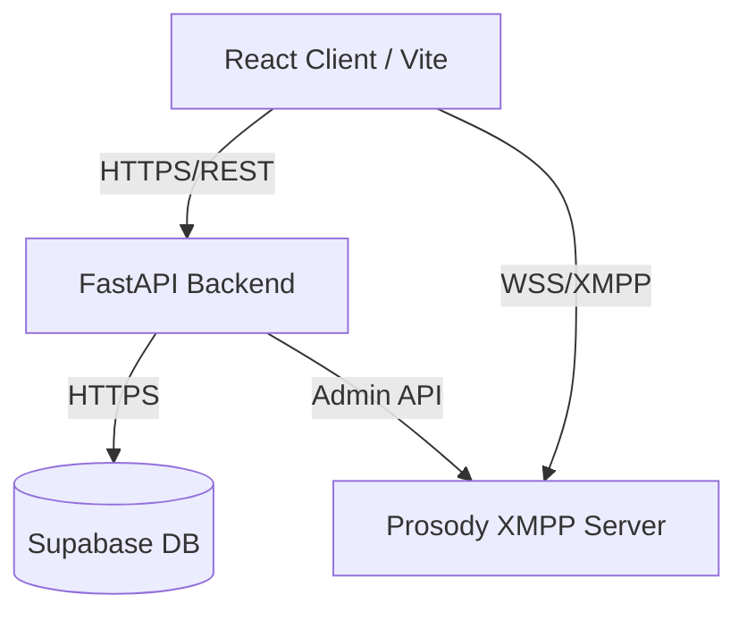

<div align="center">
  <!--  -->
  <h1>Aether Chat</h1>
  <p><strong>A modern, high-performance XMPP communication platform</strong></p>
  
  [](#)
  [](#)
  [](#)
  [](#)
  [](#)
  [](#)
  [](#)
</div>

---

## 📖 Overview

**Aether Chat** is a modern, real-time communication platform built around the robust XMPP protocol. Bridging the gap between reliable enterprise messaging infrastructure and cutting-edge web technologies, Aether Chat delivers a modern, Discord-style experience tailored for speed, scalability, and security.

This project showcases a complete full-stack architecture, utilizing a **React 19** frontend, a **FastAPI** Python backend, **Supabase** for persistence, and **Prosody** as the XMPP server engine.

> **Note**: This repository serves as a portfolio piece demonstrating advanced architectural patterns, real-time websocket integration, and modern UI/UX practices.

## ✨ Key Features

- **Real-Time Communication Engine**: Powered by XMPP (`stanza.js` on frontend, `slixmpp` on backend) and Prosody for lightning-fast message delivery.
- **Modern UI/UX**: Built with React 19, Tailwind CSS v4, and Lucide Icons, providing a responsive, beautiful, and intuitive interface.
- **Robust Authentication & Discovery**: Integrated with Supabase for secure JWT-based authentication and advanced user search capabilities.
- **Performance Optimized**: Features dynamic code splitting, chunk management, and Vite 6 to guarantee sub-second load times.
- **Internationalization (i18n)**: Fully localized UI ensuring global accessibility without performance bottlenecks.
- **Developer Experience**: Fully containerized with Docker, strict type checking, and comprehensive backend tests (`pytest`).

## 🏗️ Architecture



### Tech Stack Deep Dive

| Layer | Technologies |
| :--- | :--- |
| **Frontend** | React 19, TypeScript, Vite 6, TailwindCSS 4, React Router 7, Stanza.js, i18n |
| **Backend** | Python 3.12, FastAPI, Slixmpp, Pydantic, Passlib, Pytest |
| **Database** | Supabase (PostgreSQL) |
| **Infrastructure** | Docker, Docker Compose, Prosody XMPP |

## 🚀 Quick Start (Docker)

The entire platform is containerized for an effortless setup.

**Prerequisites**: [Docker Desktop](https://www.docker.com/products/docker-desktop/) installed and running.

### 1. Clone the Repository
```bash
git clone https://github.com/yourusername/aether-chat.git
cd aether-chat
```

### 2. Environment Setup
Create the necessary environment files:
```bash
cp backend/.env.example backend/.env
cp frontend/.env.example frontend/.env
```
*(Make sure to populate the `.env` files with your Supabase credentials)*

### 3. Build and Run
```bash
docker-compose up --build
```

### 4. Access the Application
- **Frontend App**: [http://localhost:5173](http://localhost:5173)
- **Backend API**: [http://localhost:8000](http://localhost:8000)
- **API Documentation (Swagger)**: [http://localhost:8000/docs](http://localhost:8000/docs)

## 📁 Project Structure

```text
aether-chat/
├── backend/               # FastAPI Python application
│   ├── api/               # REST controllers
│   ├── models/            # Pydantic & DB models
│   ├── services/          # Business logic & Slixmpp integration
│   ├── tests/             # Pytest test suite
│   └── main.py            # Application entry point
├── frontend/              # React application
│   ├── src/               # React components, contexts, hooks
│   ├── index.html         # Entry HTML
│   └── vite.config.ts     # Vite bundler config
├── prosody/               # XMPP server configuration & plugins
└── docker-compose.yml     # Container orchestration
```

## 🗺️ Roadmap / Future Work

- [x] Core Authentication and User Discoverability
- [x] XMPP Integration via Websockets
- [x] Internationalization (i18n)
- [ ] **WebRTC Integration**: Voice and video calling.
- [ ] **End-to-End Encryption (E2EE)**: OMEMO protocol implementation.
- [ ] **File Transfers**: XMPP SI file transfer support.

## 🤝 Contributing

Contributions, issues, and feature requests are welcome! Feel free to check the [issues page](#). For major changes, please open an issue first to discuss what you would like to change.

See [CONTRIBUTING.md](./CONTRIBUTING.md) for more details.

## 📝 License

Distributed under the MIT License. See `LICENSE` for more information.
