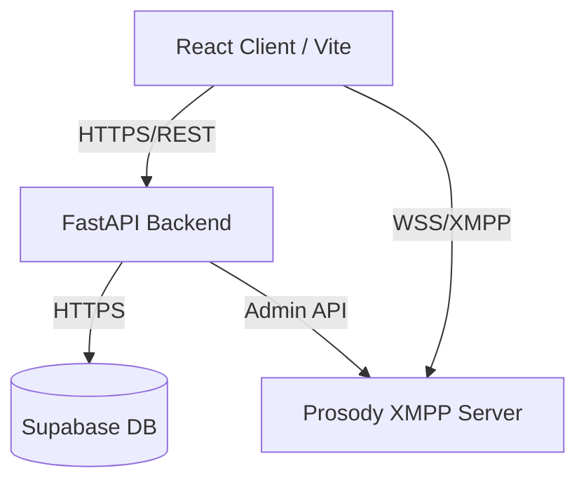

<div align="center">
  <!--  -->
  <h1>Aether Chat</h1>
  <p><strong>A modern, real-time messaging platform built on XMPP</strong></p>
  
  [](#)
  [](#)
  [](#)
  [](#)
  [](#)
  [](#)
  [](#)
</div>

---

## 📖 Despre Proiect

Aether Chat este o platformă de mesagerie în timp real pe care am construit-o pentru a explora cum un protocol tradițional și robust precum XMPP poate fi integrat cu un frontend modern în React. Obiectivul meu a fost să creez o interfață similară cu Discord, complet web-based, rapidă și scalabilă.

Sistemul folosește React 19 și TailwindCSS pentru UI, comunicând cu un backend scris în Python (FastAPI). Pentru infrastructura de mesagerie live am configurat un server XMPP Prosody, iar pentru autentificare și persistența datelor folosesc Supabase.

Este în primul rând un proiect de portofoliu în care m-am concentrat pe decizii arhitecturale solide, gestionarea corectă a conexiunilor prin WebSockets și crearea unei experiențe de utilizare fluide.

## ✨ Funcționalități Principale

- **Mesagerie în Timp Real**: Implementată prin XMPP folosind un server Prosody. Frontend-ul folosește librăria `stanza.js`, în timp ce backend-ul interacționează cu serverul prin `slixmpp`.
- **Interfață tip Discord**: Construită de la zero folosind React 19 și Tailwind CSS v4, cu suport pentru teme și un design fluid.
- **Autentificare și Căutare Utilizatori**: Gestionate prin Supabase. Utilizatorii se pot înregistra, loga securizat via JWT și pot căuta alți utilizatori din platformă.
- **Optimizare și Viteză**: Proiectul este construit cu Vite 6, folosind code-splitting dinamic și chunk management pentru a menține un timp de încărcare minim.
- **Suport Multi-limbă (i18n)**: Interfața este complet localizată.
- **Docker Ready**: Întregul sistem (Frontend, Backend, XMPP Server) poate fi pornit folosind o singură comandă de `docker-compose`.

## 🏗️ Arhitectura Sistemului



### Stack Tehnologic

| Componentă | Tehnologii |
| :--- | :--- |
| **Frontend** | React 19, TypeScript, Vite 6, TailwindCSS 4, React Router 7, Stanza.js, i18n |
| **Backend** | Python 3.12, FastAPI, Slixmpp, Pydantic, Passlib, Pytest |
| **Bază de Date** | Supabase (PostgreSQL) |
| **Infrastructură**| Docker, Docker Compose, Prosody XMPP |

## 🚀 Rulare Locală (Quick Start)

Platforma este complet containerizată cu Docker pentru a fi ușor de testat pe orice sistem (Windows, Mac, Linux).

**Cerințe**: [Docker Desktop](https://www.docker.com/products/docker-desktop/) trebuie să fie instalat și pornit.

### 1. Clonează proiectul
```bash
git clone https://github.com/EDward1101-bit/originalRepoName
cd originalRepoName
```

### 2. Configurează variabilele de mediu
Trebuie să copiezi fișierele de configurare example și să introduci credențialele tale de Supabase:
```bash
cp backend/.env.example backend/.env
cp frontend/.env.example frontend/.env
```
*(Deschide cele două fișiere `.env` și adaugă `SUPABASE_URL` și cheile anon/service.)*

### 3. Pornește containerele
Comanda de mai jos va descărca imaginile necesare, va construi proiectul și va porni serverele:
```bash
docker-compose up --build
```

### 4. Accesează Aplicația
- **Aplicația Frontend**: [http://localhost:5173](http://localhost:5173)
- **API-ul Backend**: [http://localhost:8000](http://localhost:8000)
- **Documentația API (Swagger)**: [http://localhost:8000/docs](http://localhost:8000/docs)

## 📁 Structura Proiectului

```text
aether-chat/
├── backend/               # Aplicația Python / FastAPI
│   ├── api/               # Endpoint-uri REST
│   ├── models/            # Modele de date Pydantic și baza de date
│   ├── services/          # Logica de business și integrarea Slixmpp
│   ├── tests/             # Suita de teste Pytest
│   └── main.py            # Entry point-ul API-ului
├── frontend/              # Aplicația React
│   ├── src/               # Componente, contexte, hook-uri
│   ├── index.html         # Fișierul HTML principal
│   └── vite.config.ts     # Configurarea bundler-ului Vite
├── prosody/               # Configurările și plugin-urile serverului XMPP
└── docker-compose.yml     # Orchestrarea containerelor
```

## 🗺️ Roadmap / Dezvoltări Viitoare

- [x] Autentificare de bază și funcționalitate de search utilizatori
- [x] Integrare XMPP prin Websockets
- [x] Internaționalizare (i18n)
- [ ] **Integrare WebRTC**: Apeluri audio și video.
- [ ] **End-to-End Encryption (E2EE)**: Implementarea protocolului OMEMO.
- [ ] **Transfer de Fișiere**: Suport pentru trimiterea de atașamente.

## 📝 Licență

Distribuit sub licența MIT. Vezi fișierul `LICENSE` pentru detalii.
